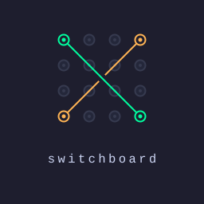

<div align="center">




</div>

# switchboard

**A zsh setup (macOS or Linux) that switches your git identity, gcloud config, and AWS profile automatically based on which directory you're in** — work context in work repos, personal everywhere else. It's a dotfiles-style bootstrap: clone it on any machine, run one guided installer, and get the same directory-aware setup plus a handful of auth helpers. It solves the everyday hazard of committing with the wrong key or running commands against the wrong cloud account.

> Requires **zsh** on **macOS or Linux**, plus a package manager (Homebrew, apt, dnf, pacman, or zypper) for the optional tool installs. Bash is not supported.

## Why

Wrong-key commits, `apply` against the wrong AWS account, `gcloud` on the wrong project — all from stale global config. switchboard keys it to the directory instead:

| Layer | Mechanism | `~/code/` | `~/code/<org>/` |
|-------|-----------|-----------|-----------------|
| Git identity | `includeIf` | personal email + key | work email + key |
| gcloud | `CLOUDSDK_ACTIVE_CONFIG_NAME` (direnv) | `personal` | `work` |
| AWS | `AWS_PROFILE` (direnv) | personal/none | work default |

Plus auth helpers (`aws-login`, `gcp-switch`, `whereami`) and a toolset-aware `my-commands` cheatsheet.

## Quick start

Only `git` is required; the installer offers to `brew install` anything else (direnv, gh, aws, gcloud, gpg, jq) you opt into.

```bash
git clone https://github.com/vikmn/switchboard.git ~/code/switchboard
~/code/switchboard/install.sh
```

Interactive, idempotent, and safe — it scans existing config for prefilled defaults, and every step is opt-in.

**What it touches** (nothing overwritten without a `.bak-<timestamp>`; `uninstall.sh` reverses it):

| File | Change |
|------|--------|
| `~/.zshrc` | `source` line (+ comments out inline copies) |
| `~/.gitconfig*` | identity files + `includeIf` rules |
| `.envrc` (code roots) | per-directory gcloud/AWS config |
| `~/.ssh/config` | optional host aliases |
| `~/.config/switchboard/` | toolset + local overrides |

Then `source ~/.zshrc` and run `my-commands` / `whereami`.

## Commands

| Command | Does |
|---------|------|
| `aws-login <profile>` | SSO login (reuses cached creds) |
| `aws-status` / `gcp-status` / `gh-status` | per-service session check |
| `gcp-switch <config>` | manual gcloud switch (Tab-completes) |
| `login-all` / `auth-status` | do / check everything |
| `whereami` (`env-status`) | active context: ● active / ○ expired per service. `--fast` = offline, instant |
| `my-commands` | the cheatsheet (extend via `my-commands-local`) |

## Committed vs local

Generic in the repo; identifying/machine-specific stays out of git:

| In the repo | Local only |
|-------------|-----------|
| helpers, installer, `*.example` templates | `~/.gitconfig*` (emails, keys) |
| the model + docs | `~/.config/switchboard/{local,toolset}.zsh` |
| | `.envrc` files (gitignored) |

## Layout

```
shell/      switchboard.zsh (loader) · cloud.zsh (helpers) · local.zsh.example
git/        gitconfig[.example] + personal/work includes + gitignore_global
direnv/     envrc.{personal,work,repo-override}.example
ssh/        ssh-config.example
install.sh · uninstall.sh · hooks/pre-commit
```

## Optional prod guard

Off by default. Set `SWITCHBOARD_PROD_PATTERN` in `local.zsh` to get a red confirm-guard before matching (e.g. prod) profiles:

```zsh
export SWITCHBOARD_PROD_PATTERN='prod|Production|live'
```

## Contributing

This is a personal setup. Bugs and ideas are welcome as [issues](https://github.com/vikmn/switchboard/issues) — the maintainer makes changes; code isn't taken via PR. Fork it freely to make your own version. See [CONTRIBUTING.md](CONTRIBUTING.md).

## One account, two SSH aliases?

Using one GitHub account for both work and personal? Point `-work`/`-personal` at the same key now; a future split becomes a one-line `IdentityFile` change instead of re-pointing every remote.
